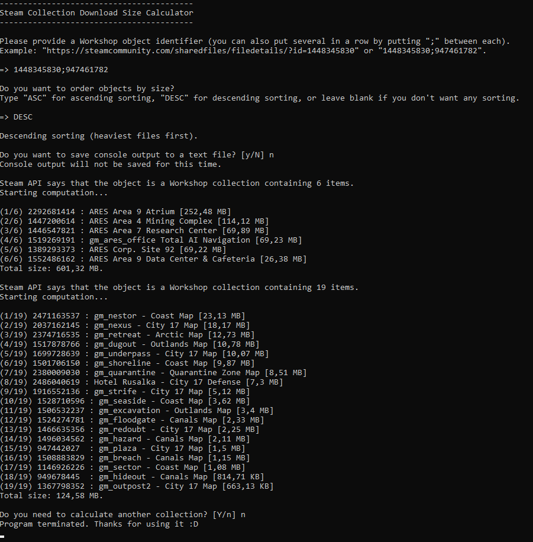

# 📐 Steam Collection Download Size Calculator

> [!IMPORTANT]
> Since May 2026, the project's code has been hosted on my custom GitLab instance, accessible at [this address](https://git.florian-dev.fr/floriantrayon/Steam-Collection-Download-Size-Calculator). The GitHub repository is a mirror of the GitLab repository, **automatically kept up to date**.
>
> **Public contributions remain on GitHub and are welcome**; validated pull requests will then be manually transferred to GitLab to be integrated. 🙂

Several months ago, I was looking for a reliable way to calculate the total size of a Workshop collection for my Garry's Mod server, so I created a Lua script using the internal [Facepunch Steamworks library,](https://wiki.facepunch.com/gmod/steamworks) but I also wanted to have this way without necessarily going through the server console or starting my game.

So I decided that using the shell (without creating a GUI) and creating a small program to achieve this result would be a good way to learn C# since my knowledge is limited to classes, but it would also give me a quick way to calculate a Workshop collection.

There might be some issues/inconsistencies in the code but of course any report/pull request are welcome!

